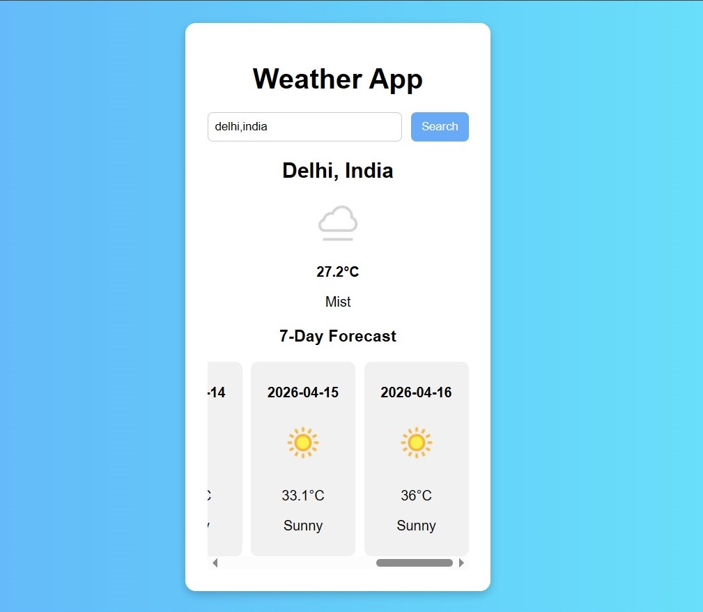

# 🌦️ Weather App with 7-Day Forecast

A modern weather application that allows users to search for any city and view real-time weather data along with a 7-day forecast.

---

## 🚀 Features

* 🔍 Search weather by city name
* 🌡️ Displays current temperature
* 🌤️ Shows weather condition with icon
* 📅 7-day weather forecast
* ⚡ Skeleton loading UI (modern UX)
* ❌ Error handling for invalid locations

---

## 🛠️ Tech Stack

* HTML
* CSS
* JavaScript
* Weather API

---

## 📸 Screenshots

*Add your screenshots here*

Example:


---

## 🔗 Live Demo

👉 https://carexpert-subhajit.github.io/Weather-app-using-API/

---

## ⚙️ How to Run Locally

1. Clone the repository:

```bash
git clone https://github.com/CarExpert-Subhajit/Weather-app-using-API.git
```

2. Open the project folder:

```bash
cd Weather-app-using-API
```

3. Open `index.html` in your browser

---

## 🔑 API Used

* WeatherAPI
* Endpoint:

```
http://api.weatherapi.com/v1/forecast.json
```

---

## ✨ Future Improvements

* 🌍 Auto-detect user location
* 🌙 Dark mode
* 🌡️ Toggle °C / °F
* 📊 Hourly forecast
* 🎨 Better UI animations

---

## 👨‍💻 Author

**Subhajit**

* GitHub: https://github.com/CarExpert-Subhajit

---

## ⭐ Show Your Support

If you like this project, please ⭐ the repository!

---
